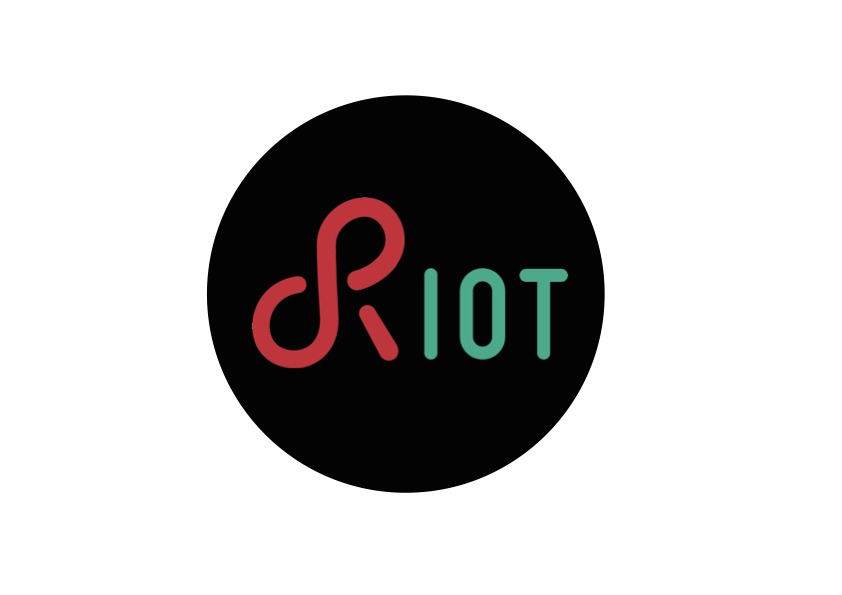

RIOT Engineering Maintainers Community (REMC)  
Memo For Comments: 0  
Author(s): Emmanuel Baccelli  
Date: December 2016
***

# Abstract

This memo describes a template for memos produced by the RIOT maintainers community.

# Status

This document is a product of the community of RIOT maintainers, and aims to 
represent the consensus within this community.
The content of this document is licensed with a Creative Commons CC-BY-SA license (TBD).

# Terminology

This memo uses the following terminology:

- REMC: RIOT Engineering Maintainers Community
- MFC: memo for comments
- PR: git pull-request to RIOT's master branch 
- ACK: acknowledgement from a RIOT maintainer, concerning a pull-request to the master branch of RIOT

# 1. Introduction

In order to facilitate RIOT maintenance in the long term and at large scale, memos are needed to complement code and usual code documentation.

This memo specifies a format for such memos and the process of discussing their content before publication.
Format and processes are somewhat inspired by [IETF](http://ietf.org/) processes and documents such as Request For Comments (RFC).

# 2. Memo Format

Memos are written in English, using the Markdown (.md) format.
Each memo has a unique identification number indicated in its header, e.g. this memo is MFC number 0.

The structure of a memo should contain:

1. a preamble as defined below,
2. the content of the memo structured as needed,
3. a postamble as defined below.

The preamble of the memo should be structured as such:

1. a header formated as the header of this memo,
2. a short abstract,
3. a status for the memo stating its license and the category of the memo, e.g. whether this is a community consensus document or an individual opinion document,
4. optionally, a terminology section which recalls/disambiguates definition of terms that are key to the memo.

The postamble of the memo should be structured as such:

1. (optional) acknowledgements section thanking contributors other than the authors,
2. a section with the main references that relate to the content, with a strong preference for permanent, self-contained references.

# 3. Memo Publishing and Maintenance Process

Each memo is proposed as a pull-request (PR) and discussed the same way RIOT code PRs are processed.
Once PRed, a memo must have received an ACK by at least one maintainer other than the author(s) of the memo, before its publication.

Once merged into the master branch of RIOT, a memo is considered published.

Once merged, small changes/clarifications may be subsequently PRed to improve a memo.
Bigger changes should result in a new memo deprecating the old memo.

A dedicated directory in RIOT codebase (RIOT/doc/memos) contains all the memos.
It is acceptable to add graphical content (in RIOT/doc/memos/graphics/) to illustrate the memo, as done with the RIOT logo below (see Figure 1, given here for pure sake of example). However graphical content should be kept to the bare minimum, as it is easy to get lost in "shiny slideware".

_Figure 1. The RIOT logo._

# Acknowledgements

Thanks to Hauke Petersen for his comments and suggestions.

# References

- Internet Engineering Task Force ([IETF](http://ietf.org/))
- Guide to [Contributing to RIOT](https://github.com/RIOT-OS/RIOT/wiki/Contributing-to-RIOT)